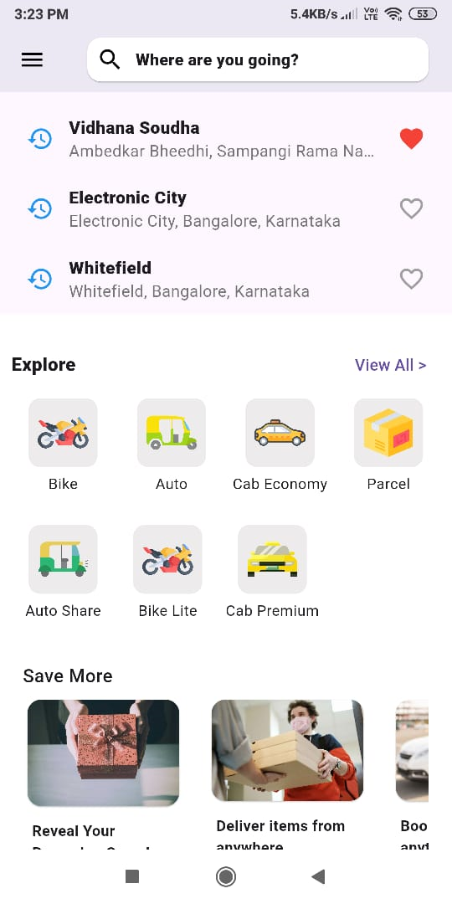
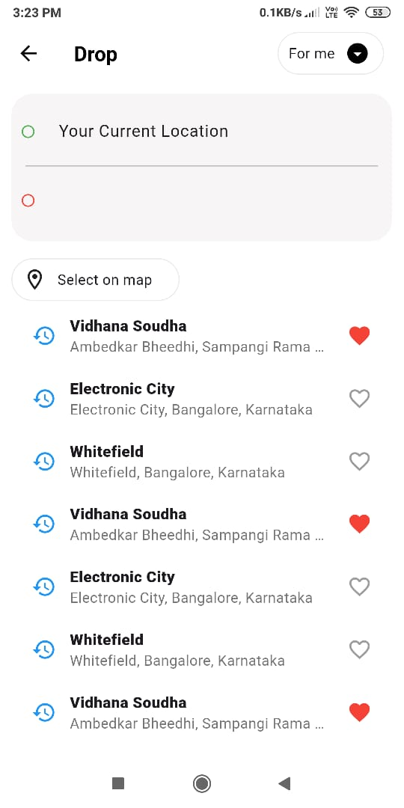
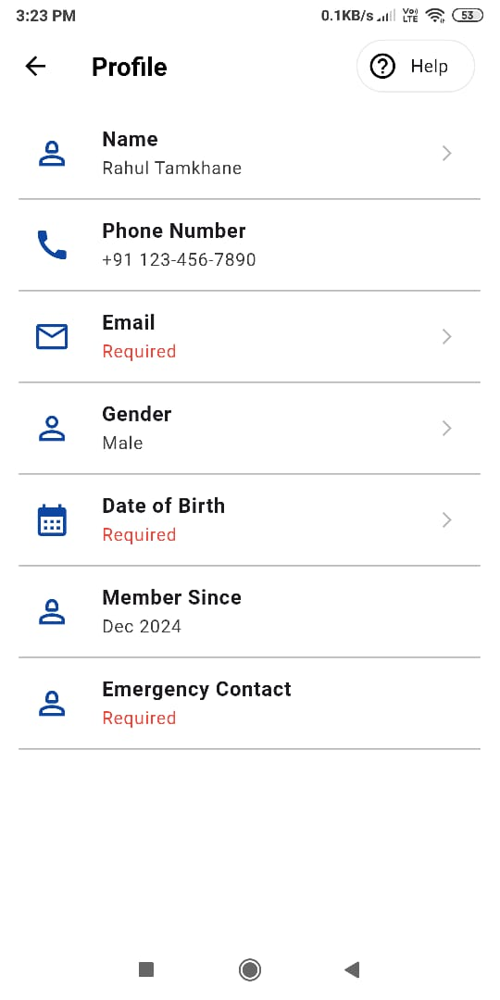
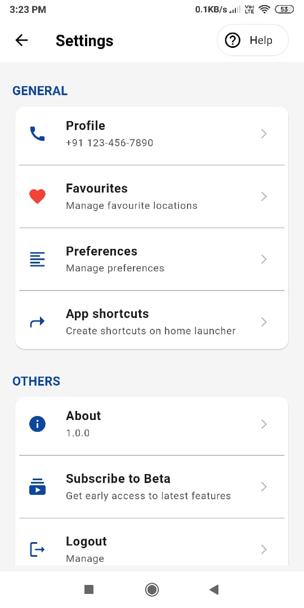

# Rapido Clone

A Rapido clone app developed in Flutter .

## Getting Started

### Technologies used
1. [Flutter](https://flutter.dev/)
2. [Dart](https://dart.dev/)

### Demo
You can download the project by running following command and run on virual device:
```
git clone https://github.com/rahultamkhane/RapidoClone.git
git RapidoClone
flutter run
```

### Screenshots
#### Home Screen
<br>
#### Pick and Dorp Point Screen
<br>
#### Profile Screen
<br>
#### Settings Screen
<br>